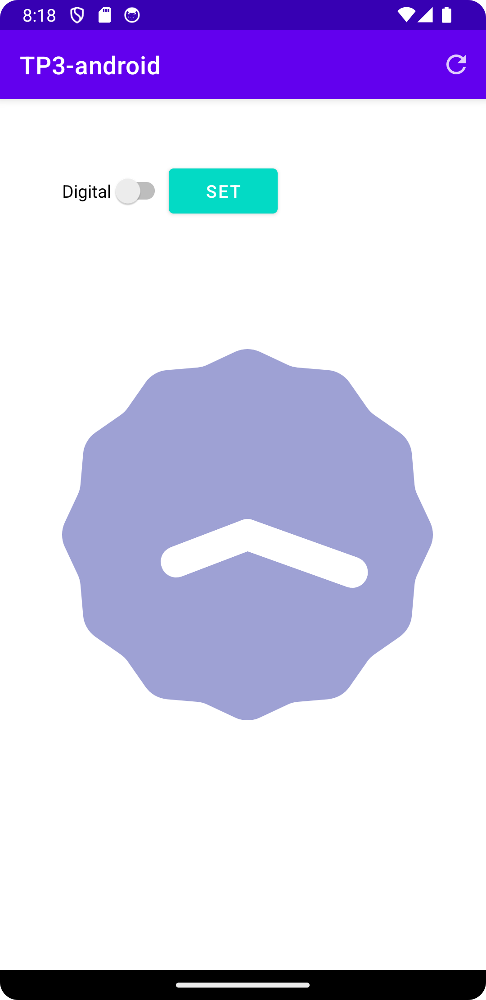
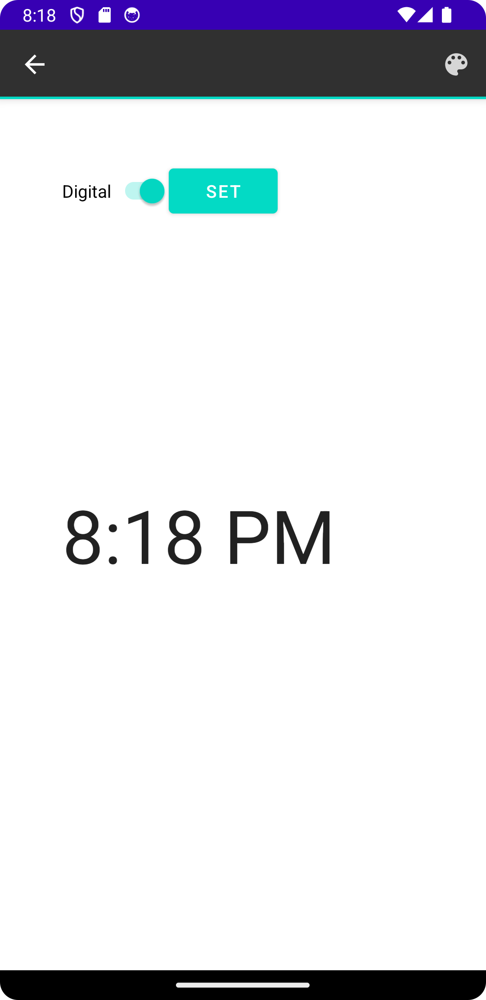

# Android App with Fragments, Themes, and Menus

## 1: Fragments
Demonstrate fragment creation and interchange in an Android app.

## 2: Action Bar and Options Menu
Enhance the app with action bar elements.

## 3: Contextual Menu
Activate contextual mode for color customization on long-press.

